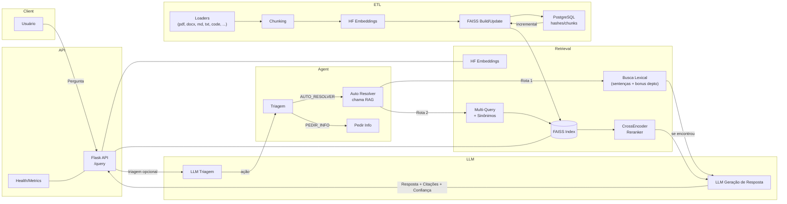

# RAG Microservice — README (atualizado)

Este projeto implementa um microserviço **RAG** (Retrieval-Augmented Generation) com duas rotas de recuperação (lexical e vetorial), **reranker** via CrossEncoder e orquestração opcional por **Agente** (LangGraph). Aqui você encontra **como rodar**, **como depurar**, **como configurar pesos e confiança**, e um **diagrama** do fluxo.

> Se preferir um documento dedicado de arquitetura, veja **ARCHITECTURE.md** (inclui o mesmo diagrama e explicações detalhadas).

---

## Sumário
- [Arquitetura (resumo + diagrama)](#arquitetura-resumo--diagrama)
- [Requisitos & Setup](#requisitos--setup)
- [Configuração (.env)](#configuração-env)
- [Executando o ETL (build do índice)](#executando-o-etl-build-do-índice)
- [Subindo a API](#subindo-a-api)
- [Consultas & Debug](#consultas--debug)
- [Como funcionam os "pesos" e a confiança](#como-funcionam-os-pesos-e-a-confiança)
- [Boas práticas & Troubleshooting](#boas-práticas--troubleshooting)

---

## Arquitetura (resumo + diagrama)

**Fluxo alto nível:**
1. O usuário chama `POST /query` com sua pergunta.
2. A API (opcionalmente) faz triagem de intenção.
3. **Rota Lexical** (prioritária): busca por sentenças que batem com termos da pergunta (com **bônus** se a fonte pertencer a um **departamento** citado). Se for suficiente, responde.
4. **Rota Vetorial** (fallback/forçada): gera **multi-queries** com base em **sinônimos** (terms.yml), consulta **FAISS**, **reranqueia** com **CrossEncoder** e calcula uma **confiança**. Se `confidence >= CONFIDENCE_MIN` e `REQUIRE_CONTEXT=true`, responde.
5. O **Agente** (LangGraph) pode tentar **AUTO_RESOLVER** chamando o RAG; se não houver contexto, retorna **PEDIR_INFO**.

### Diagrama (Mermaid)

> Visualiza corretamente no GitHub/GitLab/VSCode com extensão Mermaid.



> Versão standalone (com mais detalhes): veja **ARCHITECTURE.md**.

---

## Requisitos & Setup

- Python 3.10+ (recomendado)
- Docker opcional (há `Dockerfile.cpu` e `docker-compose.cpu.yml`)
- FAISS (via LangChain/FAISS) + HuggingFace Embeddings
- Chaves de LLM (Gemini/OpenAI) se for usar geração/triagem

Instale dependências (exemplo):
```bash
pip install -r requirements.txt
```

---

## Configuração (.env)

Crie um `.env` baseado em `.env.example`. Principais chaves:

```env
# Modelos
EMBEDDINGS_MODEL=intfloat/multilingual-e5-large
CROSS_ENCODER=jinaai/jina-reranker-v2-base-multilingual

# Limiar de resposta segura
CONFIDENCE_MIN=0.32
REQUIRE_CONTEXT=true

# Execução
ROUTE_FORCE=auto   # auto | vector
TOP_K=6
PER_QUERY=4

# Provedores LLM (opcional)
OPENAI_API_KEY=...
GEMINI_API_KEY=...
```

> **Importante:** o **ETL** agora lê `EMBEDDINGS_MODEL` do `.env`, alinhando o índice com a API em runtime.

---

## Executando o ETL (build do índice)

1. Coloque seus arquivos em `./data/` (pdf, docx, md, txt, csv, json, código, etc.).
2. Rode o build (exemplos):
   ```bash
   python etl_build_index.py
   # ou
   python etl_orchestrator.py --rebuild
   ```
3. Saída padrão do índice: `./vector_store/faiss_index` (pode variar conforme seu script).
4. Para atualizações incrementais, use os modos de **update** ou **watch** conforme seu orquestrador de ETL.

---

## Subindo a API

Via Python:
```bash
uvicorn api:app --host 0.0.0.0 --port 5000
```

Via Docker Compose:
```bash
docker compose -f docker-compose.cpu.yml up --build
```

Endpoints úteis:
- `POST /query` — consulta RAG
- `GET /healthz` — health/readiness
- `GET /metrics` — contadores simples

---

## Consultas & Debug

Exemplo de chamada com debug:
```bash
curl -s -H "Content-Type: application/json" \
  -d '{"question":"onde encontro informação de monitoria de computação?","debug":true}' \
  http://localhost:5000/query | jq
```

Campos úteis no `debug`:
- `route`: `"lexical"` ou `"vector"`
- `mq_variants`: queries geradas com base em sinônimos (terms.yml)
- `faiss.candidates[*].score`: similaridade vinda do FAISS (quando disponível)
- `rerank.enabled`: se o CrossEncoder carregou
- `rerank.scored[*].score`: score **0–1** do CrossEncoder (comanda a ordenação final)
- `confidence`: máximo dos scores do reranker (após normalização, se aplicável)

---

## Como funcionam os "pesos" e a confiança

### Rota Lexical
- Extraímos **termos candidatos** (palavras alfanuméricas ≥3, e-mails; stopwords são ignoradas).
- Procuramos **sentenças** que batem forte (fuzzy/regex). Cada acerto contribui para o score do doc.
- Se a **fonte** do documento condiz com um **departamento** citado na pergunta (via `terms.yml`), aplicamos um **bônus** (ex.: `+8`) ao melhor score daquele doc.
- Havendo hits suficientes, a resposta sai **sem** reranker (os scores exibidos podem ser `0.0` por design).

### Rota Vetorial (FAISS + Reranker)
- Geramos **multi-queries** com **sinônimos/aliases** do `terms.yml` para ampliar cobertura.
- Recuperamos candidatos no **FAISS** e registramos seus `score`s (quando disponíveis).
- Aplicamos **CrossEncoder** (0–1) para ordenar por relevância contextual.
- **Confiança (`confidence`)** = **máximo** dos scores do reranker. Se `confidence >= CONFIDENCE_MIN` **e** `REQUIRE_CONTEXT=true`, respondemos como “contexto suficiente”.

> Ajuste `CONFIDENCE_MIN` para respostas mais **conservadoras** (maior) ou mais **falantes** (menor).

---

## Boas práticas & Troubleshooting

- **Alinhar Embeddings**: garanta que ETL **e** API usem o **mesmo** `EMBEDDINGS_MODEL`.
- **Tamanho dos chunks**: ajuste para equilibrar recall e precisão (muitos micro-chunks podem “diluir” contexto; chunks enormes podem prejudicar rerank).
- **Sinônimos atualizados**: mantenha `terms.yml` com aliases relevantes; limpe termos ambíguos.
- **Observabilidade**: verifique `healthz`, counters/metrics e use `debug=true` em chamadas de teste.
- **Rota forçada**: `ROUTE_FORCE=vector` ajuda a depurar FAISS/reranker sem interferência lexical.
- **Cache** (opcional): cacheie embeddings/consultas frequentes para ganho de latência.
- **Qualidade dos dados**: remova duplicatas e normalize fontes; metadados ajudam no rerank.

---

## Licença
MIT (ou a de sua preferência).
