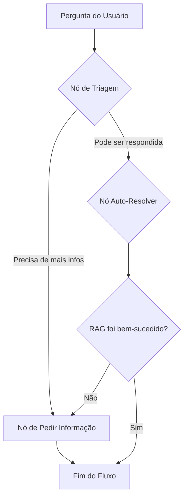

# Microsserviço RAG com Agente LangGraph

Este projeto implementa um sistema de Pergunta-Resposta (Question-Answering) baseado em RAG (Retrieval-Augmented Generation), orquestrado por um agente inteligente construído com LangGraph. A solução é conteinerizada com Docker e projetada para ser modular, robusta e avaliável.

## Sumário
- [Arquitetura](#arquitetura)
- [Como Executar (Docker)](#como-executar-docker)
- [Endpoints da API](#endpoints-da-api)
- [Avaliação do Sistema](#avaliação-do-sistema)
- [Executando os Testes](#executando-os-testes)
- [Estrutura do Projeto](#estrutura-do-projeto)
- [Variáveis de Ambiente](#variáveis-de-ambiente)
- [Status Atual e Próximos Passos](#status-atual-e-próximos-passos)

---

## Arquitetura

O sistema combina duas lógicas principais: um pipeline de RAG direto e um fluxo de agente mais sofisticado que o orquestra.

### 1. Fluxo do Agente (LangGraph)

O agente decide a melhor forma de responder a uma pergunta, podendo pedir mais informações ou acionar o pipeline de RAG.



### 2. Pipeline de RAG (Retrieval-Augmented Generation)

Este é o núcleo da busca e geração de respostas, acionado pelo agente.

```mermaid
flowchart TD
    Q[Pergunta Autônoma] --> MQ[Multi-Query];
    MQ -->|q1..qn| FAISS[(Busca Vetorial FAISS)];
    FAISS --> RERANK[CrossEncoder (Rerank)];
    RERANK --> CTX[Seleção de Contexto];
    CTX --> LLM[LLM - Geração da Resposta Final];
    LLM --> OUT[Markdown + Citações];
```

---

## Como Executar (Docker)

A maneira mais simples e recomendada de executar o projeto é usando o Docker Compose.

### 1. Pré-requisitos
- Docker e Docker Compose instalados.
- Uma chave de API do Google Gemini (obtenha em [Google AI Studio](https://aistudio.google.com/app/apikey)).

### 2. Configuração

Copie o arquivo de exemplo `.env.example` para um novo arquivo chamado `.env`.

```bash
cp .env.example .env
```

Abra o arquivo `.env` e **insira sua chave de API do Google** na variável `GOOGLE_API_KEY`.

### 3. Execução

Escolha o ambiente (CPU ou GPU) e execute o comando correspondente na raiz do projeto.

**Para ambiente com CPU:**
```bash
docker-compose -f docker-compose.cpu.yml up --build
```

**Para ambiente com GPU (requer NVIDIA Container Toolkit):**
```bash
docker-compose -f docker-compose.gpu.yml up --build
```

O primeiro build pode demorar alguns minutos. Após a inicialização, os seguintes serviços estarão disponíveis:
- **API do RAG:** `http://localhost:5000`
- **Interface Web (UI):** `http://localhost:8080`
- **Banco de Dados (Postgres):** `localhost:5432`

> **Dica:** a interface web (porta 8080) encaminha qualquer chamada para `/api/...` ao mesmo serviço Flask na porta 5000. Exemplos: `http://localhost:5000/query` (direto) e `http://localhost:8080/api/query` (via UI).

---

## Endpoints da API

### Endpoint Principal do Agente

- **URL:** `POST /agent/ask`
- **Alias:** `POST /api/ask` (exposto pelo proxy da UI em `http://localhost:8080`)
- **Descrição:** Processa uma pergunta usando o fluxo completo do agente LangGraph. Suporta histórico de conversa e aceita overrides via payload.
- **Payload (JSON):**
  ```json
  {
    "question": "Qual é o e-mail do departamento de biologia?",
    "messages": [
      {"role": "user", "content": "Qual o contato do depto de bio?"},
      {"role": "assistant", "content": "Não encontrei um departamento com esse nome. Poderia especificar o nome completo?"}
    ],
    "max_refine_attempts": 1
  }
  ```
  - `max_refine_attempts` (opcional) limita quantas reformulações automáticas o agente pode fazer na chamada (padrão: `AGENT_REFINE_MAX_ATTEMPTS`).
  - O corpo da resposta inclui `meta.query_hash`, `meta.refine_history`, `meta.refine_prompt_hashes` e `meta.confidence`, úteis para correlacionar com os registros e métricas.

### Endpoint Legado (RAG Direto)

- **URL:** `POST /query`
- **Alias:** `POST /api/query` (quando acessado via Nginx/porta 8080)
- **Descrição:** Processa uma pergunta usando apenas o pipeline de RAG direto, sem a camada do agente.

Ambos os endpoints retornam o campo opcional `"needs_clarification"` quando o sistema encontra múltiplos candidatos (ex.: pessoas com o mesmo nome). Isso gera uma resposta enumerando as opções disponíveis e incrementa o contador `queries_ambiguous` em `/metrics`.

---

## Cache de Respostas (Redis)

- O `docker-compose.*` agora sobe um serviço Redis (`ai_redis`) que atende ao cache de respostas.
- Configure `REDIS_URL` (padrão `redis://ai_redis:6379/0`) e `CACHE_TTL_SECONDS` (12 horas) para controlar a camada de cache.
- O ETL invalida o cache automaticamente ao final de rebuilds e atualizações incrementais, e a variável `INDEX_VERSION` faz parte da assinatura das chaves.
- `/metrics` passou a expor `cache_hits_total` e `cache_misses_total`, permitindo acompanhar a eficiência do cache.
- Para garantir o funcionamento, há testes dedicados: `python -m pytest tests/test_api_cache.py`.
- Consulte `docs/METRICS.md` para exemplos de consulta e alertas Prometheus/Grafana.

---

## Auto-refine do Agente LangGraph

- Quando o RAG entrega baixa confiança, o agente tenta até duas reformulações automáticas antes de pedir mais contexto ao usuário.
- As novas consultas são geradas via LLM (`refine_query_prompt.txt`) e reutilizam o pipeline completo de RAG, registrando o histórico (e hashes) em `meta.refine_history`/`meta.refine_prompt_hashes`.
- Novas métricas expostas em `/metrics`: `agent_refine_attempts_total`, `agent_refine_success_total`, `agent_refine_exhausted_total` e `agent_low_confidence_total`.
- Ajuste a estratégia com `AGENT_REFINE_ENABLED`, `AGENT_REFINE_MAX_ATTEMPTS`, `AGENT_REFINE_CONFIDENCE`, o limiar de confiança por rota (`CONFIDENCE_MIN_AGENT`) e, via payload, `max_refine_attempts`.
- A suíte `python -m pytest tests/test_agent_workflow.py` valida fluxos de sucesso e fallback.

## Avaliação do Sistema

O projeto inclui um script de avaliação de ponta a ponta que usa `ragas` e `langchain-google-genai` para calcular métricas automáticas.

1.  Garanta que as dependências estejam instaladas (`pip install -r requirements-cpu.txt`) e que a variável `GOOGLE_API_KEY` esteja configurada no ambiente.
2.  Inicie a API localmente (Docker Compose ou ambiente manual).
3.  Execute o script `eval_rag.py`, informando o dataset via argumento posicional ou pelo flag `--dataset`.

```bash
# Exemplo de execução com saída em reports/
python eval_rag.py --dataset tests/eval_sample.csv --out reports/
```

Use `--agent-endpoint` e `--legacy-endpoint` para apontar para URLs específicas quando necessário.

O relatório consolida métricas de **Recuperação** (Recall, MRR, nDCG). Quando a chave `GOOGLE_API_KEY` está definida, o script também produz as métricas de **Geração** (Faithfulness e Answer Relevancy) via RAGAs.
> **Checklist rápido:** o script agora emite mensagens explícitas quando as dependências do RAGAs ou a `GOOGLE_API_KEY` estão ausentes. O teste `python -m pytest tests/test_eval_rag.py` cobre esses cenários e garante proteção regressiva.

## Executando os Testes

O projeto utiliza `pytest` para testes automatizados. Para executar a suíte de testes:

1.  Instale as dependências correspondentes ao seu ambiente (fora do Docker elas precisam incluir FAISS e Torch):
    ```bash
    pip install -r requirements-cpu.txt  # ou requirements-gpu.txt se estiver com CUDA
    ```
2.  Execute o pytest na raiz do projeto:
    ```bash
    pytest -v
    ```

---

## Estrutura do Projeto

```
. C:/Temp/Workspace/rag-microservice
├── 📄 .env.example        # Exemplo de arquivo de configuração
├── 📄 api.py              # Servidor Flask, expõe os endpoints da API
├── 📄 agent_workflow.py   # Orquestra a lógica do agente com LangGraph
├── 📄 query_handler.py    # Implementa a lógica central de RAG (busca e geração)
├── 📄 llm_client.py       # Cliente unificado e robusto para interagir com LLMs
├── 📄 etl_orchestrator.py # Pipeline de ETL para construir o índice vetorial
├── 📄 eval_rag.py         # Script para avaliação de ponta-a-ponta do sistema
├── 📄 telemetry.py        # Módulo de logging de telemetria
├── 📁 loaders/           # Módulo unificado para carregar documentos de diferentes formatos
├── 📁 prompts/           # Armazena os prompts usados pelo agente e pelo RAG
├── 📁 data/              # Contém os documentos fonte para o ETL
├── 📁 config/            # Arquivos de configuração adicionais (ex: ontologias)
├── 📁 tests/             # Testes automatizados com pytest
├── 🐳 Dockerfile.cpu      # Define a imagem Docker para ambiente CPU
├── 🐳 Dockerfile.gpu      # Define a imagem Docker para ambiente GPU
├── 🐳 docker-compose.cpu.yml  # Stack completa otimizada para CPU
└── 🐳 docker-compose.gpu.yml  # Stack completa com suporte a GPU
```

---

## Variáveis de Ambiente

As principais variáveis de ambiente para configurar o comportamento do sistema estão no arquivo `.env`. Consulte o `.env.example` para uma lista completa e descrições detalhadas. Destaques:

- **LLM**: `GOOGLE_API_KEY` e `GOOGLE_MODEL` (ex.: `models/gemini-2.5-flash-lite`).
- **Embeddings/FAISS**: `EMBEDDINGS_MODEL` (ETL e API precisam usar o mesmo valor) e `FAISS_STORE_DIR`.
- **Reranker**: `RERANKER_PRESET` (`off | fast | balanced | full`) e `RERANKER_ENABLED=true`. O preset `balanced` usa `jinaai/jina-reranker-v1-base-multilingual` (boa qualidade no CPU). Ajuste `RERANKER_CANDIDATES`, `RERANKER_TOP_K`, `RERANKER_MAX_LEN` conforme latência desejada.
- **Busca híbrida**: `HYBRID_ENABLED` (default `true`), `LEXICAL_THRESHOLD` (default `90`), `DEPT_BONUS`, `MAX_PER_SOURCE`.
- **Multi-query e confiança**: `MQ_ENABLED`, `MQ_VARIANTS`, `CONFIDENCE_MIN` (com overrides opcionais `CONFIDENCE_MIN_QUERY`/`CONFIDENCE_MIN_AGENT`) e `REQUIRE_CONTEXT`.
- **Formato da resposta**: `STRUCTURED_ANSWER` (markdown com resumo/fontes) e `MAX_SOURCES`.
- **Agente (auto-refine)**: `AGENT_REFINE_ENABLED`, `AGENT_REFINE_MAX_ATTEMPTS`, `AGENT_REFINE_CONFIDENCE`.

Caso queira forçar uma rota específica para debug, use `ROUTE_FORCE=lexical|vector`.

---

## Status Atual e Próximos Passos

### Verificação Recente do Reranker

Em testes recentes, foi verificado que o componente de reranqueamento está ativo e funcional (`"enabled": true`). Ele reordena os *chunks* recuperados pela busca vetorial, aplicando uma lógica de relevância mais refinada.

**Conclusão:** O reranker funciona como esperado. No entanto, a resposta final gerada a partir do *chunk* melhor classificado apresentou um score de confiança muito baixo (ex: 0.0036). Isso indica que, embora o reordenamento técnico funcione, a relevância do conteúdo recuperado ainda não é ótima para responder a certas perguntas, sendo um ponto-chave para as próximas melhorias.

### Sugestões de Melhoria

Para aumentar a relevância e a confiança das respostas, as seguintes ações são recomendadas:

1.  **Reforço Lexical e Boosts**:
    *   Ajustar as expansões de multi-query em `CUSTOM_MQ_EXPANSIONS` para gerar variações mais ricas e direcionadas (ex: incluir termos como "e-mail stpg reserva").
    *   Analisar as `mq_variants` (com `debug=true`) para validar a eficácia das novas expansões.

2.  **Afinar Termos da Ontologia**:
    *   Em `config/ontology/terms.yml`, aumentar os `boosts` de termos importantes e adicionar mais sinônimos (`aliases`) para conceitos como "reserva", "impressão", "LEPEC", etc.

3.  **Reavaliação Contínua**:
    *   Após cada ajuste, rodar o script de avaliação para medir o impacto de forma objetiva:
        ```bash
        python eval_rag.py --compare --label "nome-do-experimento"
        ```

Para um roteiro mais detalhado de melhorias planejadas, consulte o documento [melhorias.md](docs/melhorias.md).


## Documentação adicional

Toda a documentação complementar foi movida para a pasta docs/:

- [Visão de arquitetura](docs/ARCHITECTURE.md)
- [Contexto operacional](docs/contexto.md)
- [Plano de melhorias e backlog](docs/melhorias.md)
- [Telemetria e observabilidade](docs/TELEMETRY.md)
- [Publicação de imagens Docker](docs/publish_images.md)

### Imagens pré-construídas (opcional)

Resumo rápido:
1. Faça login no registry (ex.: docker login, docker login ghcr.io).
2. Rode ./scripts/build_and_publish_images.sh --prefix SEU_PREFIXO --tag SUA_TAG --push.
3. Configure as variáveis RAG_IMAGE_PREFIX e RAG_IMAGE_TAG (via shell ou arquivo .env).
4. Depois execute docker-compose pull + docker-compose up para usar as imagens publicadas.

Para o passo a passo completo consulte [docs/publish_images.md](docs/publish_images.md).
Observação: o script gera imagens para ai_projeto_api e ai_etl. A UI continua usando nginx:1.27-alpine e não precisa de push.


