# Microsserviço RAG com Agente LangGraph

Este projeto implementa um sistema de Pergunta-Resposta (Question-Answering) baseado em RAG (Retrieval-Augmented Generation), orquestrado por um agente inteligente construído com LangGraph. A solução é conteinerizada com Docker e projetada para ser modular, robusta e avaliável.

## Sumário
- [Arquitetura](#arquitetura)
- [Como Executar (Docker)](#como-executar-docker)
- [Endpoints da API](#endpoints-da-api)
- [Avaliação do Sistema](#avaliação-do-sistema)
- [Executando os Testes](#executando-os-testes)
- [Estrutura do Projeto](#estrutura-do-projeto)
- [Variáveis de Ambiente](#variáveis-de-ambiente)
- [Status Atual e Próximos Passos](#status-atual-e-próximos-passos)

---

## Arquitetura

O sistema combina duas lógicas principais: um pipeline de RAG direto e um fluxo de agente mais sofisticado que o orquestra.

### 1. Fluxo do Agente (LangGraph)

O agente decide a melhor forma de responder a uma pergunta, podendo pedir mais informações ou acionar o pipeline de RAG.

```mermaid
flowchart TD
    A[Pergunta do Usuário] --> B{Nó de Triagem};
    B -- "Precisa de mais infos" --> C[Nó de Pedir Informação];
    B -- "Pode ser respondida" --> D{Nó Auto-Resolver};
    C --> F[Fim do Fluxo];
    D --> E{RAG foi bem-sucedido?};
    E -- Sim --> F;
    E -- Não --> C;
```



### 2. Pipeline de RAG (Retrieval-Augmented Generation)

Este é o núcleo da busca e geração de respostas, acionado pelo agente.

```mermaid
flowchart TD
    Q[Pergunta Autônoma] --> MQ[Multi-Query];
    MQ -->|q1..qn| FAISS[(Busca Vetorial FAISS)];
    FAISS --> RERANK[CrossEncoder (Rerank)];
    RERANK --> CTX[Seleção de Contexto];
    CTX --> LLM[LLM - Geração da Resposta Final];
    LLM --> OUT[Markdown + Citações];
```

---

## Como Executar (Docker)

A maneira mais simples e recomendada de executar o projeto é usando o Docker Compose.

### 1. Pré-requisitos
- Docker e Docker Compose instalados.
- Uma chave de API do Google Gemini (obtenha em [Google AI Studio](https://aistudio.google.com/app/apikey)).

### 2. Configuração

Copie o arquivo de exemplo `.env.example` para um novo arquivo chamado `.env`.

```bash
cp .env.example .env
```

Abra o arquivo `.env` e **insira sua chave de API do Google** na variável `GOOGLE_API_KEY`.

### 3. Execução

Escolha o ambiente (CPU ou GPU) e execute o comando correspondente na raiz do projeto.

**Para ambiente com CPU:**
```bash
docker-compose -f docker-compose.cpu.yml up --build
```

**Para ambiente com GPU (requer NVIDIA Container Toolkit):**
```bash
docker-compose -f docker-compose.gpu.yml up --build
```

O primeiro build pode demorar alguns minutos. Após a inicialização, os seguintes serviços estarão disponíveis:
- **API do RAG:** `http://localhost:5000`
- **Interface Web (UI):** `http://localhost:8080`
- **Banco de Dados (Postgres):** `localhost:5432`

---

## Endpoints da API

### Endpoint Principal do Agente

- **URL:** `POST /agent/ask`
- **Descrição:** Processa uma pergunta usando o fluxo completo do agente LangGraph. Suporta histórico de conversa.
- **Payload (JSON):**
  ```json
  {
    "question": "Qual é o e-mail do departamento de biologia?",
    "messages": [
      {"role": "user", "content": "Qual o contato do depto de bio?"},
      {"role": "assistant", "content": "Não encontrei um departamento com esse nome. Poderia especificar o nome completo?"}
    ]
  }
  ```

### Endpoint Legado (RAG Direto)

- **URL:** `POST /query`
- **Descrição:** Processa uma pergunta usando apenas o pipeline de RAG direto, sem a camada do agente.

---

## Avaliação do Sistema

O projeto inclui um script de avaliação de ponta a ponta que utiliza a biblioteca `ragas`.

1.  **Garanta que a API esteja em execução.**
2.  Execute o script `eval_rag.py`, passando o caminho para um arquivo CSV com os dados de teste.

```bash
# Exemplo de execução
python eval_rag.py tests/eval_sample.csv
```

O script irá calcular e exibir métricas de **Recuperação** (Recall, MRR, nDCG) e de **Geração** (Faithfulness, Answer Relevancy).

---

## Executando os Testes

O projeto utiliza `pytest` para testes automatizados. Para executar a suíte de testes:

1.  Instale as dependências correspondentes ao seu ambiente (fora do Docker elas precisam incluir FAISS e Torch):
    ```bash
    pip install -r requirements-cpu.txt  # ou requirements-gpu.txt se estiver com CUDA
    ```
2.  Execute o pytest na raiz do projeto:
    ```bash
    pytest -v
    ```

---

## Estrutura do Projeto

```
. C:/Temp/Workspace/rag-microservice
├── 📄 .env.example        # Exemplo de arquivo de configuração
├── 📄 api.py              # Servidor Flask, expõe os endpoints da API
├── 📄 agent_workflow.py   # Orquestra a lógica do agente com LangGraph
├── 📄 query_handler.py    # Implementa a lógica central de RAG (busca e geração)
├── 📄 llm_client.py       # Cliente unificado e robusto para interagir com LLMs
├── 📄 etl_orchestrator.py # Pipeline de ETL para construir o índice vetorial
├── 📄 eval_rag.py         # Script para avaliação de ponta-a-ponta do sistema
├── 📄 telemetry.py        # Módulo de logging de telemetria
├── 📁 loaders/           # Módulo unificado para carregar documentos de diferentes formatos
├── 📁 prompts/           # Armazena os prompts usados pelo agente e pelo RAG
├── 📁 data/              # Contém os documentos fonte para o ETL
├── 📁 config/            # Arquivos de configuração adicionais (ex: ontologias)
├── 📁 tests/             # Testes automatizados com pytest
├── 🐳 Dockerfile.cpu      # Define a imagem Docker para ambiente CPU
├── 🐳 Dockerfile.gpu      # Define a imagem Docker para ambiente GPU
├── 🐳 docker-compose.cpu.yml  # Stack completa otimizada para CPU
└── 🐳 docker-compose.gpu.yml  # Stack completa com suporte a GPU
```

---

## Variáveis de Ambiente

As principais variáveis de ambiente para configurar o comportamento do sistema estão no arquivo `.env`. Consulte o `.env.example` para uma lista completa e descrições detalhadas. Destaques:

- **LLM**: `GOOGLE_API_KEY` e `GOOGLE_MODEL` (ex.: `models/gemini-2.5-flash-lite`).
- **Embeddings/FAISS**: `EMBEDDINGS_MODEL` (ETL e API precisam usar o mesmo valor) e `FAISS_STORE_DIR`.
- **Reranker**: `RERANKER_PRESET` (`off | fast | balanced | full`) e `RERANKER_ENABLED=true`. O preset `balanced` usa `jinaai/jina-reranker-v1-base-multilingual` (boa qualidade no CPU). Ajuste `RERANKER_CANDIDATES`, `RERANKER_TOP_K`, `RERANKER_MAX_LEN` conforme latência desejada.
- **Busca híbrida**: `HYBRID_ENABLED` (default `true`), `LEXICAL_THRESHOLD` (default `90`), `DEPT_BONUS`, `MAX_PER_SOURCE`.
- **Multi-query e confiança**: `MQ_ENABLED`, `MQ_VARIANTS`, `CONFIDENCE_MIN` e `REQUIRE_CONTEXT`.
- **Formato da resposta**: `STRUCTURED_ANSWER` (markdown com resumo/fontes) e `MAX_SOURCES`.

Caso queira forçar uma rota específica para debug, use `ROUTE_FORCE=lexical|vector`.

---

## Status Atual e Próximos Passos

### Verificação Recente do Reranker

Em testes recentes, foi verificado que o componente de reranqueamento está ativo e funcional (`"enabled": true`). Ele reordena os *chunks* recuperados pela busca vetorial, aplicando uma lógica de relevância mais refinada.

**Conclusão:** O reranker funciona como esperado. No entanto, a resposta final gerada a partir do *chunk* melhor classificado apresentou um score de confiança muito baixo (ex: 0.0036). Isso indica que, embora o reordenamento técnico funcione, a relevância do conteúdo recuperado ainda não é ótima para responder a certas perguntas, sendo um ponto-chave para as próximas melhorias.

### Sugestões de Melhoria

Para aumentar a relevância e a confiança das respostas, as seguintes ações são recomendadas:

1.  **Reforço Lexical e Boosts**:
    *   Ajustar as expansões de multi-query em `CUSTOM_MQ_EXPANSIONS` para gerar variações mais ricas e direcionadas (ex: incluir termos como "e-mail stpg reserva").
    *   Analisar as `mq_variants` (com `debug=true`) para validar a eficácia das novas expansões.

2.  **Afinar Termos da Ontologia**:
    *   Em `config/ontology/terms.yml`, aumentar os `boosts` de termos importantes e adicionar mais sinônimos (`aliases`) para conceitos como "reserva", "impressão", "LEPEC", etc.

3.  **Reavaliação Contínua**:
    *   Após cada ajuste, rodar o script de avaliação para medir o impacto de forma objetiva:
        ```bash
        python eval_rag.py --compare --label "nome-do-experimento"
        ```

Para um roteiro mais detalhado de melhorias planejadas, consulte o documento [melhorias.md](./melhorias.md).