# Microsserviço RAG com Agente LangGraph

Este projeto implementa um sistema de Pergunta-Resposta (Question-Answering) baseado em RAG (Retrieval-Augmented Generation), orquestrado por um agente inteligente construído com LangGraph. A solução é conteinerizada com Docker e projetada para ser modular, robusta e avaliável.

## Sumário
- [Arquitetura](#arquitetura)
- [Como Executar (Docker)](#como-executar-docker)
- [Endpoints da API](#endpoints-da-api)
- [Avaliação do Sistema](#avaliação-do-sistema)
- [Executando os Testes](#executando-os-testes)
- [Estrutura do Projeto](#estrutura-do-projeto)
- [Variáveis de Ambiente](#variáveis-de-ambiente)
- [Status Atual e Próximos Passos](#status-atual-e-próximos-passos)

---

## Arquitetura

O sistema combina duas lógicas principais: um pipeline de RAG direto e um fluxo de agente mais sofisticado que o orquestra.

### 1. Fluxo do Agente (LangGraph)

O agente decide a melhor forma de responder a uma pergunta, podendo pedir mais informações ou acionar o pipeline de RAG.

```mermaid
flowchart TD
    A[Pergunta do Usuário] --> B{Nó de Triagem};
    B -- "Precisa de mais infos" --> C[Nó de Pedir Informação];
    B -- "Pode ser respondida" --> D{Nó Auto-Resolver};
    C --> F[Fim do Fluxo];
    D --> E{RAG foi bem-sucedido?};
    E -- Sim --> F;
    E -- Não --> C;
```



### 2. Pipeline de RAG (Retrieval-Augmented Generation)

Este é o núcleo da busca e geração de respostas, acionado pelo agente.

```mermaid
flowchart TD
    Q[Pergunta Autônoma] --> MQ[Multi-Query];
    MQ -->|q1..qn| FAISS[(Busca Vetorial FAISS)];
    MQ -->|q1..qn| BM25[(Busca Lexical BM25)];
    FAISS --> FUSE[MMR + RRF];
    BM25 --> FUSE;
    FUSE --> RERANK[CrossEncoder - Rerank];
    RERANK --> CTX[Seleção de Contexto];
    CTX --> LLM[LLM - Geração da Resposta Final];
    LLM --> OUT[Markdown + Citações];
```



O pipeline executa múltiplas variações da pergunta, consulta simultaneamente o índice vetorial (FAISS) e a busca lexical BM25, aplica **MMR (λ≈0,3)** para evitar duplicidade, realiza a fusão **RRF** e, por fim, refina a ordem com o cross-encoder `cross-encoder/ms-marco-MiniLM-L-6-v2` (configurável no `.env`). Caso a confiança final fique abaixo do limiar configurado, o sistema tenta automaticamente uma segunda rodada de busca, expandindo a consulta com sinônimos institucionais antes de pedir esclarecimentos ao usuário.

---

## Como Executar (Docker)

A maneira mais simples e recomendada de executar o projeto é usando o Docker Compose.

### 1. Pré-requisitos
- Docker e Docker Compose instalados.
- Uma chave de API do Google Gemini (obtenha em [Google AI Studio](https://aistudio.google.com/app/apikey)).

### 2. Configuração

Copie o arquivo de exemplo `.env.example` para um novo arquivo chamado `.env`.

```bash
cp .env.example .env
```

Abra o arquivo `.env` e **insira sua chave de API do Google** na variável `GOOGLE_API_KEY`.

### 3. Execução

Escolha o ambiente (CPU ou GPU) e execute o comando correspondente na raiz do projeto.

**Para ambiente com CPU:**
```bash
docker-compose -f docker-compose.cpu.yml up --build
```

**Para ambiente com GPU (requer NVIDIA Container Toolkit):**
```bash
docker-compose -f docker-compose.gpu.yml up --build
```

O primeiro build pode demorar alguns minutos. Após a inicialização, os seguintes serviços estarão disponíveis:
- **API do RAG:** `http://localhost:5000`
- **Interface Web (UI):** `http://localhost:8080`
- **Banco de Dados (Postgres):** `localhost:5432`

> **Dica:** a interface web (porta 8080) encaminha qualquer chamada para `/api/...` ao mesmo serviço Flask na porta 5000. Exemplos: `http://localhost:5000/query` (direto) e `http://localhost:8080/api/query` (via UI).

---

## Endpoints da API

### Endpoint Principal do Agente

- **URL:** `POST /agent/ask`
- **Alias:** `POST /api/ask` (exposto pelo proxy da UI em `http://localhost:8080`)
- **Descrição:** Processa uma pergunta usando o fluxo completo do agente LangGraph. Suporta histórico de conversa e aceita overrides via payload.
- **Payload (JSON):**
  ```json
  {
    "question": "Qual é o e-mail do departamento de biologia?",
    "messages": [
      {"role": "user", "content": "Qual o contato do depto de bio?"},
      {"role": "assistant", "content": "Não encontrei um departamento com esse nome. Poderia especificar o nome completo?"}
    ],
    "max_refine_attempts": 1
  }
  ```
  - `max_refine_attempts` (opcional) limita quantas reformulações automáticas o agente pode fazer na chamada (padrão: `AGENT_REFINE_MAX_ATTEMPTS`).
  - O corpo da resposta inclui `meta.query_hash`, `meta.refine_history`, `meta.refine_prompt_hashes` e `meta.confidence`, úteis para correlacionar com os registros e métricas.

### Endpoint Legado (RAG Direto)

- **URL:** `POST /query`
- **Alias:** `POST /api/query` (quando acessado via Nginx/porta 8080)
- **Descrição:** Processa uma pergunta usando apenas o pipeline de RAG direto, sem a camada do agente.

Ambos os endpoints retornam o campo opcional `"needs_clarification"` quando o sistema encontra múltiplos candidatos (ex.: pessoas com o mesmo nome). Isso gera uma resposta enumerando as opções disponíveis e incrementa o contador `queries_ambiguous` em `/metrics`.

---

## Cache de Respostas (Redis)

- O `docker-compose.*` agora sobe um serviço Redis (`ai_redis`) que atende ao cache de respostas.
- Configure `REDIS_URL` (padrão `redis://ai_redis:6379/0`) e `CACHE_TTL_SECONDS` (12 horas) para controlar a camada de cache.
- O ETL invalida o cache automaticamente ao final de rebuilds e atualizações incrementais, e a variável `INDEX_VERSION` faz parte da assinatura das chaves.
- `/metrics` passou a expor `cache_hits_total` e `cache_misses_total`, permitindo acompanhar a eficiência do cache.
- Para garantir o funcionamento, há testes dedicados: `python -m pytest tests/test_api_cache.py`.
- Consulte `docs/METRICS.md` para exemplos de consulta e alertas Prometheus/Grafana.

---

## Auto-refine do Agente LangGraph

- Quando o RAG entrega baixa confiança, o agente tenta até duas reformulações automáticas antes de pedir mais contexto ao usuário.
- As novas consultas são geradas via LLM (`refine_query_prompt.txt`) e reutilizam o pipeline completo de RAG, registrando o histórico (e hashes) em `meta.refine_history`/`meta.refine_prompt_hashes`.
- Novas métricas expostas em `/metrics`: `agent_refine_attempts_total`, `agent_refine_success_total`, `agent_refine_exhausted_total` e `agent_low_confidence_total`.
- Ajuste a estratégia com `AGENT_REFINE_ENABLED`, `AGENT_REFINE_MAX_ATTEMPTS`, `AGENT_REFINE_CONFIDENCE`, o limiar de confiança por rota (`CONFIDENCE_MIN_AGENT`) e, via payload, `max_refine_attempts`.
- A suíte `python -m pytest tests/test_agent_workflow.py` valida fluxos de sucesso e fallback.

## Avaliação do Sistema

O projeto inclui um script de avaliação de ponta a ponta que usa `ragas` e `langchain-google-genai` para calcular métricas automáticas.

1.  Garanta que as dependências estejam instaladas (`pip install -r requirements-cpu.txt`) e que a variável `GOOGLE_API_KEY` esteja configurada no ambiente.
2.  Inicie a API localmente (Docker Compose ou ambiente manual).
3.  Execute o script `eval_rag.py`, informando o dataset via argumento posicional ou pelo flag `--dataset`.

```bash
# Exemplo de execução com saída em reports/
python eval_rag.py --dataset tests/eval_sample.csv --out reports/
```

Use `--agent-endpoint` e `--legacy-endpoint` para apontar para URLs específicas quando necessário.

O relatório consolida métricas de **Recuperação** (Recall, MRR, nDCG). Quando a chave `GOOGLE_API_KEY` está definida, o script também produz as métricas de **Geração** (Faithfulness e Answer Relevancy) via RAGAs.
> **Checklist rápido:** o script agora emite mensagens explícitas quando as dependências do RAGAs ou a `GOOGLE_API_KEY` estão ausentes. O teste `python -m pytest tests/test_eval_rag.py` cobre esses cenários e garante proteção regressiva.

### Dump de debug por pergunta

Para auditar rapidamente quais rotas, candidatos e metadados foram usados em cada pergunta do dataset, use:

```bash
python scripts/dump_eval_debug.py \
  --dataset evaluation_dataset.jsonl \
  --mode agent \
  --output reports/debug-dump-$(date +%Y%m%d-%H%M%S)
```

O script envia cada pergunta com `debug=true` e salva um JSON por item (incluindo `debug.timing_ms`, rota escolhida, top-k pré/pós-rerank, contatos extraídos e confiança final). Em ambientes Windows/PowerShell substitua a variável de data por um nome fixo de pasta, por exemplo `--output reports/debug-dump`.

## Executando os Testes

O projeto utiliza `pytest` para testes automatizados. Para executar a suíte de testes:

1.  Instale as dependências correspondentes ao seu ambiente (fora do Docker elas precisam incluir FAISS e Torch):
    ```bash
    pip install -r requirements-cpu.txt  # ou requirements-gpu.txt se estiver com CUDA
    ```
2.  Execute o pytest na raiz do projeto:
    ```bash
    pytest -v
    ```

### Checklist de validação local
Siga os passos abaixo antes de publicar novas imagens ou documentação (exemplo em PowerShell/Windows):

```bash
# Ambiente e dependências
python -m venv .venv
.\.venv\Scripts\activate
pip install -r requirements.txt

# Avaliação RAGAs (gera relatório em reports/)
set GOOGLE_API_KEY=SEU_TOKEN
python eval_rag.py ^
  --dataset evaluation_dataset.jsonl ^
  --agent-endpoint http://localhost:5000/agent/ask ^
  --legacy-endpoint http://localhost:5000/query ^
  --out reports/

# Smoke tests (API direta e via proxy)
python scripts/smoke_api.py http://localhost:5000/api
python scripts/smoke_api.py http://localhost:8080/api

# Cenário funcional (telefone / contato)
curl -fsS http://localhost:8080/agent/ask ^
  -H "Content-Type: application/json" ^
  -d "{\"question\":\"Qual o telefone da Andreia da computacao?\",\"messages\":[],\"debug\":true}" ^
  | python -m json.tool
```
> A resposta deve vir pela rota `contact_fallback`, exibindo telefone e e-mail específicos.

---

## Estrutura do Projeto

```
. C:/Temp/Workspace/rag-microservice
├── 📄 .env.example        # Exemplo de arquivo de configuração
├── 📄 api.py              # Servidor Flask, expõe os endpoints da API
├── 📄 agent_workflow.py   # Orquestra a lógica do agente com LangGraph
├── 📄 query_handler.py    # Implementa a lógica central de RAG (busca e geração)
├── 📄 llm_client.py       # Cliente unificado e robusto para interagir com LLMs
├── 📄 etl_orchestrator.py # Pipeline de ETL para construir o índice vetorial
├── 📄 eval_rag.py         # Script para avaliação de ponta-a-ponta do sistema
├── 📄 telemetry.py        # Módulo de logging de telemetria
├── 📁 loaders/           # Módulo unificado para carregar documentos de diferentes formatos
├── 📁 prompts/           # Armazena os prompts usados pelo agente e pelo RAG
├── 📁 data/              # Contém os documentos fonte para o ETL
├── 📁 config/            # Arquivos de configuração adicionais (ex: ontologias)
├── 📁 tests/             # Testes automatizados com pytest
├── 🐳 Dockerfile.cpu      # Define a imagem Docker para ambiente CPU
├── 🐳 Dockerfile.gpu      # Define a imagem Docker para ambiente GPU
├── 🐳 docker-compose.cpu.yml  # Stack completa otimizada para CPU
└── 🐳 docker-compose.gpu.yml  # Stack completa com suporte a GPU
```

---

## Variáveis de Ambiente

As principais variáveis de ambiente para configurar o comportamento do sistema estão no arquivo `.env`. Consulte o `.env.example` para uma lista completa e descrições detalhadas. Destaques:

- **LLM**: `GOOGLE_API_KEY` e `GOOGLE_MODEL` (ex.: `models/gemini-2.5-flash-lite`).
- **Embeddings/FAISS**: `EMBEDDINGS_MODEL` (ETL e API precisam usar o mesmo valor) e `FAISS_STORE_DIR`.
- **Reranker**: `RERANKER_PRESET` (`off | fast | balanced | full`) e `RERANKER_ENABLED=true`. No `.env` recomendamos o preset `full` com o cross-encoder `cross-encoder/ms-marco-MiniLM-L-6-v2`, `RERANKER_CANDIDATES=48`, `RERANKER_TOP_K=10` e `RERANKER_MAX_LEN=512`. Ajuste conforme a latência aceitável e o hardware disponível.
- **Recuperação (BM25 + FAISS)**: `HYBRID_ENABLED` (default `true`), `RETRIEVAL_FETCH_K` (`80`), `RETRIEVAL_K` (`8`), `RETRIEVAL_MMR_LAMBDA` (`0.35`), `RETRIEVAL_MMR_LAMBDA_SHORT` (`0.25`), `RETRIEVAL_MIN_SCORE` (`0.25`), além dos parâmetros `MAX_PER_SOURCE`, `LEXICAL_THRESHOLD` e `DEPT_BONUS` para controlar boosts e diversidade.
- **Multi-query e confiança**: `MQ_ENABLED`, `MQ_VARIANTS`, `MQ_USE_LLM`, `MQ_LLM_MAX_VARIANTS`, `CONFIDENCE_MIN` (com overrides opcionais `CONFIDENCE_MIN_QUERY`/`CONFIDENCE_MIN_AGENT`) e `REQUIRE_CONTEXT`. Quando a confiança final cai abaixo de `RETRIEVAL_MIN_SCORE`, o sistema dispara automaticamente uma segunda rodada de busca antes de abrir o fluxo de esclarecimento ao usuário.
- **Formato da resposta**: `STRUCTURED_ANSWER` (markdown com resumo/fontes) e `MAX_SOURCES`.
- **Agente (auto-refine)**: `AGENT_REFINE_ENABLED`, `AGENT_REFINE_MAX_ATTEMPTS`, `AGENT_REFINE_CONFIDENCE`.
- **Ontologia/boosts institucionais**: `TERMS_YAML` aponta para `config/ontology/terms.yml` (ou caminho customizado). O mesmo valor deve ser usado na API e no ETL para manter sincronia de boosts, sinônimos e expansões multi-query.

Caso queira forçar uma rota específica para debug, use `ROUTE_FORCE=lexical|vector`.

---

## Status Atual e Próximos Passos

### Panorama atual

- O pipeline de recuperação combina BM25 + FAISS, aplica MMR (`λ≈0,3`) antes da fusão RRF e finaliza com o reranker `cross-encoder/ms-marco-MiniLM-L-6-v2`, entregando mais diversidade e precisão nos trechos recuperados.
- Logs e telemetria agora registram as listas top-30/top-8 antes e depois do rerank, além da query efetivamente usada (incluindo a variação automática quando `RETRIEVAL_MIN_SCORE` é violado).
- O cache Redis, o auto-refine do agente e os testes de API continuam verdes (`pytest tests/test_api.py`), garantindo que as alterações sejam regressão-free.

### Ações sugeridas

1. **Rodar avaliação objetiva**  
   Execute `python eval_rag.py --out reports/` (com `GOOGLE_API_KEY` configurada) para medir o impacto das mudanças nas métricas RAGAs (`faithfulness`, `context_precision`, etc.) e versionar o relatório gerado.

2. **Expandir ontologia e boosts**  
   Revise `config/ontology/terms.yml` para adicionar sinônimos institucionais, ajustar `boosts.department` e enriquecer `mq_expansions`. Isso reforça o BM25 e beneficia a rodada automática de retry.

3. **Monitorar as novas métricas**  
   Acompanhe `/metrics` (novos contadores de cache, agent refine e low confidence) e os registros JSON em `logs/queries.log` para validar se o retry automático está ajudando — especialmente nas consultas de baixa confiança antes problemáticas.

Para um roteiro mais detalhado de melhorias planejadas, consulte o documento [melhorias.md](docs/melhorias.md).


## Documentação adicional

Toda a documentação complementar foi movida para a pasta docs/:

- [Visão de arquitetura](docs/ARCHITECTURE.md)
- [Contexto operacional](docs/contexto.md)
- [Plano de melhorias e backlog](docs/melhorias.md)
- [Telemetria e observabilidade](docs/TELEMETRY.md)
- [Publicação de imagens Docker](docs/publish_images.md)

### Imagens pré-construídas (opcional)

Resumo rápido:
1. Faça login no registry (ex.: docker login, docker login ghcr.io).
2. Rode ./scripts/build_and_publish_images.sh --prefix SEU_PREFIXO --tag SUA_TAG --push.
3. Configure as variáveis RAG_IMAGE_PREFIX e RAG_IMAGE_TAG (via shell ou arquivo .env).
4. Depois execute docker-compose pull + docker-compose up para usar as imagens publicadas.

Para o passo a passo completo consulte [docs/publish_images.md](docs/publish_images.md).
Observação: o script gera imagens para ai_projeto_api e ai_etl. A UI continua usando nginx:1.27-alpine e não precisa de push.
