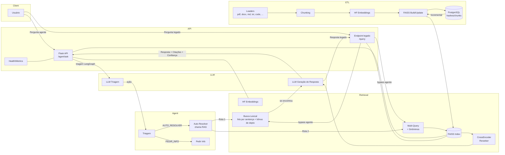

# Arquitetura & Fluxo do Sistema (RAG + Agente)

## Passo a passo (resumo)
1. **Entrada**: o usuário envia uma pergunta para `POST /agent/ask` (também exposto como `/api/ask` via proxy da UI). Há ainda o endpoint legado `POST /query` (roteado como `/api/query` na UI) que chama o pipeline direto.
> A interface Nginx (`ai_web_ui`) encaminha chamadas feitas para `/api/...` em `localhost:8080` para os mesmos endpoints expostos pela API Flask em `localhost:5000`.
2. **Triagem/roteamento**: o agente LangGraph decide a ação (responder direto, pedir esclarecimentos ou acionar o RAG).
3. **Rota Lexical**: se houver bons *hits* por sentença (com bônus por departamento), responde diretamente com trechos/citações.
4. **Rota Vetorial**: caso contrário, gera **multi-queries** (sinônimos do `terms.yml`), consulta o **FAISS**, reranqueia com **CrossEncoder** e calcula a **confiança**.
5. **Resgate/Resposta**: o texto final é gerado pelo LLM usando os trechos mais relevantes. `confidence >= CONFIDENCE_MIN` libera resposta “segura” quando `REQUIRE_CONTEXT=true`.
6. **ETL**: arquivos em `data/` são carregados pelos *loaders*, *chunkados*, embedded e indexados no FAISS. Metadados/hashes vão para o PostgreSQL para **atualizações incrementais**.

## Notas de Configuração
- **Embeddings**: defina `EMBEDDINGS_MODEL` no `.env` para alinhar **ETL** e **API**.
- **Confiança**: o padrão atual no README é `CONFIDENCE_MIN=0.32`.
- **Sinônimos/Boosts**: mantenha `terms.yml` para *aliases*, *synonyms* e *boosts*.
- **Observabilidade**: use `/healthz`, `/metrics` e `debug=true` no `/query` para inspeções.
